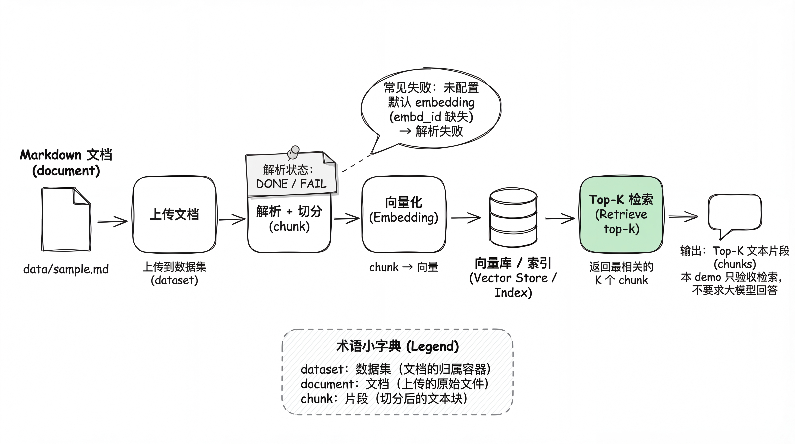

# PowerRAG SDK 文本问答检索 Demo

## 一、这篇专题要解决什么问题？

很多同学做 RAG 时会先把注意力放在“怎么让大模型回答得更像人”。但只要检索没找对上下文，生成再花哨也只是“把错讲得更顺”。

这个专题做一件更朴素、也更值得先掌握的事：

> **只做检索，不做生成。**

你会把一份 Markdown 文档交给服务端，让服务端完成解析、切分、向量化，然后用问题去做 Top‑K 检索，拿回最相关的原文片段（chunks）。

**验收标准也很直接**：Top‑K chunks 是否与问题语义相关（不要求最终答案）。

本专题目录结构：

- `readme.md`：本文（教学文档）
- `images/`：配图
- `code/`：可运行脚本与配置（`main.py`、`config.py`、`.env.example`、`requirements.txt`）
- `data/`：可复现样例数据（`sample.md` + `questions.txt`）

---

## 二、技术方案：从 Markdown 到 Top‑K chunks（图文讲清楚）

下面这张图展示了端到端链路，也基本对应 `code/main.py` 的执行顺序。

<div align="center">
  
  <p>图 10.1: 端到端流程（本 demo 只验收检索结果，不要求生成最终回答）</p>
</div>

为了避免“看完图还是不知道自己要做什么”，这里把图 10.1 的关键节点按顺序讲清楚（你可以边对照图边往下读）：

**（1）本地输入：Markdown 文档**

你可以直接用本专题提供的 `data/sample.md`。这份文件故意写得短：包含“排队规则”和“退款规则”，方便你用不同问题去验证检索是否命中。

**（2）Upload：上传到 dataset**

上传不是“把文本发过去就结束”，它的意义在于：服务端要把这份文档纳入某个 **dataset**（容器）里，后续切分出来的 chunks、embedding、索引都挂在这个容器下面。

**（3）Parse/Chunk：解析 + 切分**

这一步会把 Markdown 解析成可检索的文本结构，并按服务端策略切成多个 chunk。

> ⚠️ 图里标了一个常见失败点：如果你的 tenant 没有配置默认 embedding（`embd_id` 为空或未授权），解析任务可能直接 FAIL。

**（4）Embedding：向量化**

每个 chunk 会被映射成向量（embedding）。这一步是向量检索的前提——没有向量，后面就谈不上“语义相似”。

**（5）写入向量库/索引**

chunk + embedding 会写入向量索引（图里叫 Vector Store / Index）。

**（6）Retrieve Top‑K：检索并返回 chunks**

输入一个问题（question），服务端从索引里找出最相关的 K 个 chunk，并把这些原文片段返回给你。本 demo 的验收就看这里：**返回的 chunks 是否包含你期望的规则段落**。

---

到这里，你应该已经能把这条链路从头到尾“顺着说一遍”了：

> 文档上传 → 服务端解析/切分/向量化 → 写入索引 → 问题检索 → 返回 Top‑K chunks。

但很多初学者还有一个常见困惑：**这些名词到底对应什么对象？我拿到的结果到底是谁？**

所以下面我们换一个视角：不再看“流程”，而是看“对象之间的关系”。

---

再看图 10.2（对象关系）。这张图的目的只有一个：把“你上传的文件”和“检索返回的结果”彻底区分开。

很多同学第一次用 RAG 平台 SDK，会把这些概念混在一起。你只要记住：

- **dataset**：容器（装很多文档）
- **document**：你上传的那份文件
- **chunk**：文档切分出来的文本片段（检索返回的就是它）

<div align="center">
  
  <p>图 10.2: 对象关系与返回结构（检索返回的核心对象是 chunk）</p>
</div>

图 10.2 里最容易忽略、但最关键的一点是：**检索返回的是 chunk，不是 document。**

- document 是“你上传的整份文件”
- chunk 是“切分后的片段”，它才是检索、重排、压缩、最终拼上下文的基本单位

所以你在终端里看到的 Top‑K 结果，应该是一段段原文片段，而不是整篇 Markdown。

> 💡 小白自检：我怎么判断“这段 chunk 就是我想要的那段”？
>
> 很简单：用你自己的语言把问题再复述一遍，然后在返回的 chunk 里找“能直接支撑答案的原文句子”。
> 例如你问“已发货未签收能不能退款”，chunk 里应当出现“已发货未签收：可申请退款，但需要承担退货运费”这一类关键句。

---
## 三、实现思路：从零写一版“最小检索脚本”（带代码块）

先给一个“最小骨架”（你可以把它当作伪代码，但它基本就是 `code/main.py` 的主干）：

```python
rag = RAGFlow(api_key=..., base_url=...)

# 1) 创建 dataset（容器）
dataset = rag.create_dataset(name=...)

# 2) 上传文档（拿到 doc.id）
doc = dataset.upload_documents([{...}])[0]

# 3) 解析/切分/向量化（失败大多发生在这里）
parse_results = dataset.parse_documents([doc.id])

# 4) 检索 Top-K chunks（验收点）
chunks = rag.retrieve(question=..., dataset_ids=[dataset.id], document_ids=[doc.id], page_size=top_k)
```

下面把每一步展开讲清楚（并配上代码片段）。

### 3.1 参数与配置：先让脚本可复现

先从命令行参数入手，理解脚本“能调什么”。`code/main.py` 里最常用的是这几个：

```python
parser.add_argument("--file", type=Path, required=True)
parser.add_argument("--question", type=str, required=True)
parser.add_argument("--top-k", type=int, default=DEFAULT_CONFIG.top_k)
parser.add_argument("--dataset-name", type=str, default=DEFAULT_CONFIG.dataset_name)
parser.add_argument("--base-url", type=str, default=DEFAULT_CONFIG.base_url)
parser.add_argument("--api-key", type=str, default=DEFAULT_CONFIG.api_key)
```

- `--file`：你要上传哪份 Markdown
- `--question`：你想验证的提问
- `--top-k`：返回多少个 chunk
- `--dataset-name`：本次创建/使用的数据集名字
- `--base-url/--api-key`：PowerRAG 服务端地址与 SDK token

这几个参数足够让你完成“换文档、换问题、调 Top‑K、连不同服务端”这四类最常见实验。

> 💡 小白自检：为什么这里既支持命令行参数，又支持 `.env`？
>
> 因为这两种场景都很常见：
>
> - 你本地调试时，喜欢用 `.env` 固定住 base_url/api_key
> - 你改参数做实验时，喜欢命令行直接覆盖（不用反复改文件）

### 3.2 初始化 SDK：先连上再说

```python
from ragflow_sdk import RAGFlow

rag = RAGFlow(api_key=api_key, base_url=base_url)
```

这里没有花活：就是把请求的 base_url 和 token 配好。

### 3.3 创建 dataset：把文档放进“一个篮子里”

```python
dataset_kwargs = {"name": args.dataset_name}
if args.embedding_model:
    dataset_kwargs["embedding_model"] = args.embedding_model
dataset = rag.create_dataset(**dataset_kwargs)
```

为什么要先有 dataset？因为“上传/解析/检索”都需要一个边界。
你不希望每次检索都在整个租户的所有文档里搜；你希望“只在这次实验的文档集合里搜”。

> 💡 小白自检：能不能不建 dataset，直接上传然后检索？
>
> 取决于平台能力。但在 PowerRAG/RAGFlow 这类系统里，dataset 是“组织边界”。
> 没有边界，检索要么全库搜（不可控），要么压根没有地方挂索引。

### 3.4 上传 document：得到 doc.id，后面都靠它

```python
docs = dataset.upload_documents([
    {"display_name": display_name, "blob": blob}
])
doc = docs[0]
```

上传成功后，SDK 会返回一个 document 对象（至少包含 `doc.id`）。
后续的 parse 和 retrieve 都要用它来限定范围。

> 💡 小白自检：为什么要限定 `document_ids=[doc.id]`？
>
> 因为你这次实验只关心“这份文档”的检索效果。
> 如果不限定，dataset 里有多份文档时，你可能会检索到别的文档的 chunk，导致结果看起来“跑偏”。

### 3.5 解析 / 切分 / 向量化：最容易踩坑的一步

```python
parse_results = dataset.parse_documents([doc.id])
print("Parse results:")
print(parse_results)
```

脚本会把 parse 的状态打印出来，并且做了一个很直接的判断：

```python
statuses = {r[1] for r in parse_results if isinstance(r, (list, tuple)) and len(r) >= 2}
if statuses and statuses != {"DONE"}:
    raise SystemExit("Document parsing failed (status not DONE)...")
```

你可以把它理解为“验收关卡”：

- **DONE**：说明服务端已经把文档切成 chunk，并完成（或至少开始完成）向量化与索引写入
- **FAIL/其他状态**：先别着急改代码，优先排查 tenant 默认 embedding

> 经验：`Model(@None) not authorized` 基本就是在提示“默认 embedding 没配/没权限”。

> 💡 小白自检：为什么 embedding 配置会影响“解析（parse）”？
>
> 因为这里的 parse 往往不是“纯语法解析 Markdown”，而是一条“解析 → 切分 → 向量化 → 写索引”的流水线任务。
> embedding 不可用时，流水线中途失败，平台就会把整个任务标为 FAIL。

### 3.6 检索 Top‑K：你真正要验收的结果

```python
chunks = rag.retrieve(
    question=args.question,
    dataset_ids=[dataset.id],
    document_ids=[doc.id],
    page=1,
    page_size=args.top_k,
    similarity_threshold=args.similarity_threshold,
    vector_similarity_weight=args.vector_similarity_weight,
    top_k=args.candidate_k,
    keyword=args.keyword,
)
```

这里有两个点值得你留意（也是很多人调参的入口）：

- `page_size=args.top_k`：你最终想看多少条 chunk
- `similarity_threshold`：太高会过滤掉结果导致空，太低会混进无关段落

最后脚本会把每条 chunk 的内容预览打印出来：

```python
for i, c in enumerate(chunks, start=1):
    content = _safe_get(c, "content", "")
    print(f"{i:02d}. {content[:260]}")
```

你要做的“人工验收”也很简单：看看这几段文字是不是回答问题所需的那几段原文。

> 💡 小白自检：Top‑K 是不是越大越好？
>
> 不是。Top‑K 太大容易把无关 chunk 混进来；太小又可能漏掉关键段落。
> 教学 demo 里一般用 3~8 都够用。

---

### 3.7 先跑通一次（最短路径）

> ⚠️ 注意：解析/向量化依赖 embedding。如果你的 tenant 没有配置默认 embedding（`embd_id` 为空或未授权），解析阶段会 FAIL。不要先怀疑 Python。

```bash
# 1) 安装依赖
cd Extra-chapter/PowerRAG-SDK-Text-QA/code
python -m venv .venv
source .venv/bin/activate
pip install -r requirements.txt

# 2) 配置 .env（在 code/ 目录下）
cp .env.example .env

# 3) 回到专题根目录运行（data/ 路径更直观）
cd ..
python code/main.py \
  --file data/sample.md \
  --question "已发货未签收的退款规则是什么？" \
  --top-k 5 \
  --cleanup
```

你会看到两段关键输出：

1. `Parse results`：解析/分块状态（期望 `DONE`）
2. `Retrieved chunks`：Top‑K chunks 的内容预览

---

---

## 四、经验总结与坑点（把时间花在对的地方）

很多时候问题不在“你写的 Python”，而在“服务端是不是已经把 embedding 产出来了”。

<div align="center">
  
  <p>图 10.3: code/main.py 与服务端 API 的交互顺序（简化版）</p>
</div>

如果你只记一条顺序，就记这句：

> **先上传 → 再解析（产出 chunk+embedding）→ 最后检索（返回 chunk）**

很多“为什么检索不到”的问题，本质是解析还没成功，索引里根本没有向量。

---

### 4.1 Parse results 是 FAIL

优先检查 tenant 的默认 embedding（`embd_id`）是否已配置且可用。典型错误：

- `Model(@None) not authorized`
- `Parse results: ... FAIL ...`

如果已经配置仍失败，直接看 task executor 日志最省时间：

```bash
docker exec powerrag-powerrag-1 sh -lc 'tail -n 200 /ragflow/logs/task_executor_* | tail -n 200'
```

### 4.2 401/403：token 类型搞混

PowerRAG 常见会同时出现两类 token：

- Web 层 `AUTH`（用于 `/v1/*`）
- SDK 的 `ragflow-...` token（用于 `/api/v1/*`，通常写在 `Authorization: Bearer <ragflow-...>`）

如果你看到 401/403，先确认 token 类型和接口前缀是否匹配。

---

---

## 附录：用 API 配默认 embedding + 生成 ragflow token（重操作区）

> 这部分是“环境/账号/服务端配置”，放到附录，避免主线被淹没。

### A1. 用 API 配好 embedding（通用）

这一步需要一个 Web 层的 `AUTH`（`/v1/*` 使用），它和 SDK 的 `ragflow-...` key 不是一回事。

你可以把 embedding 配置写进 `.env`（见 `.env.example` 的 `EMB_*`），下面命令会读取 `EMB_FACTORY/EMB_MODEL/EMB_API_BASE/EMB_API_KEY`。

#### A1.1 获取 `AUTH`（注册并从响应头拿 Authorization）

PowerRAG 的 `/v1/user/register` 要求 password 先用服务端的 RSA public key 加密。最省事的方式是在容器内调用它自带的加密函数：

```bash
BASE_URL="http://127.0.0.1:9380"

ENC_PW="$(docker exec powerrag-powerrag-1 sh -lc 'python - <<"PY"\nfrom api.utils.crypt import crypt\nprint(crypt("powerrag"))\nPY')"

EMAIL="powerrag.demo.$(date +%s)@example.com"
AUTH="$(curl -sS -D - -o /dev/null -X POST "$BASE_URL/v1/user/register" \
  -H 'Content-Type: application/json' \
  -d "{\"nickname\":\"demo\",\"email\":\"$EMAIL\",\"password\":\"$ENC_PW\"}" \
| awk 'BEGIN{IGNORECASE=1} /^authorization:/{print $2}' | tr -d '\r')"
```

#### A1.2 绑定 embedding 的外部 API

> 注意：`max_tokens` 需要显式传，否则可能报数据库字段错误。

```bash
curl -sS -X POST "$BASE_URL/v1/llm/add_llm" \
  -H "Authorization: $AUTH" \
  -H 'Content-Type: application/json' \
  -d '{
    "llm_factory": "'"${EMB_FACTORY}"'",
    "model_type": "embedding",
    "llm_name": "'"${EMB_MODEL}"'",
    "api_base": "'"${EMB_API_BASE}"'",
    "api_key": "'"${EMB_API_KEY}"'",
    "max_tokens": 8192
  }'
```

#### A1.3 设置 tenant 默认 `embd_id`

```bash
TENANT_ID="$(curl -sS -H "Authorization: $AUTH" "$BASE_URL/v1/user/tenant_info" | python -c 'import sys,json; print(json.load(sys.stdin)["data"]["tenant_id"])')"

curl -sS -X POST "$BASE_URL/v1/user/set_tenant_info" \
  -H "Authorization: $AUTH" \
  -H 'Content-Type: application/json' \
  -d "{\"tenant_id\":\"$TENANT_ID\",\"llm_id\":\"\",\"embd_id\":\"${EMB_MODEL}@${EMB_FACTORY}\",\"asr_id\":\"\",\"img2txt_id\":\"\"}"
```

### A2. 生成 SDK 的 `ragflow-...` api_key

SDK 接口在 `/api/v1/*`，它不认 `AUTH`，需要 `ragflow-...` 这种 token（放在 header：`Authorization: Bearer <ragflow-...>`）。

用 `AUTH` 创建一个 SDK key：

```bash
DIALOG_ID="$(python -c 'import uuid; print(uuid.uuid4().hex)')"
API_KEY="$(curl -sS -X POST "$BASE_URL/v1/api/new_token" \
  -H "Authorization: $AUTH" \
  -H 'Content-Type: application/json' \
  -d "{\"dialog_id\":\"$DIALOG_ID\"}" \
| python -c 'import sys,json; print(json.load(sys.stdin)["data"]["token"])')"

echo "$API_KEY"
```
